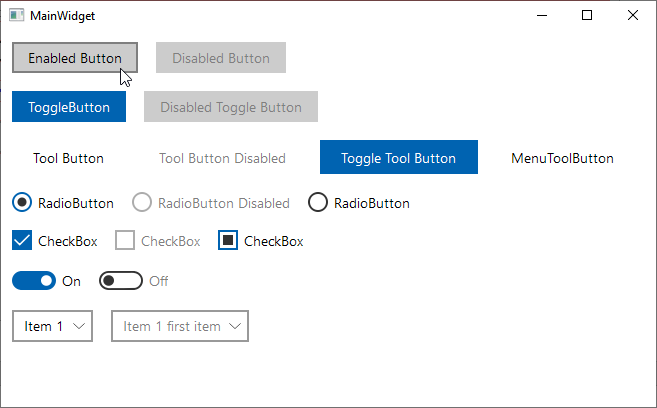

# QtFluentDesign

The goal of this project is to use Qt stylesheets to create a style for Qt widget
applications that is as close as possible to the modern [Microsoft Fluent Design](https://www.microsoft.com/design/fluent/#/) in Windows 10. The project is in a very early state. The final goal is to provide a style
that is able to automatically adapt to the selected Windows 10 theme (light or
dark) and that is able to use the system or a user specific accent color.

## Interesting Links

- [Microsoft Fluent Design](https://www.microsoft.com/design/fluent/#/)
- [Microsoft XAML Controls Gallery](https://docs.microsoft.com/en-us/samples/microsoft/xaml-controls-gallery/xaml-controls-gallery/)
- [How to get a blurred translucent QML Window (similar to Fluent Design guidelines) on Windows 10?](https://stackoverflow.com/questions/57626018/how-to-get-a-blurred-translucent-qml-window-similar-to-fluent-design-guidelines)
- [Office UI Fabric Icons](https://uifabricicons.azurewebsites.net/)
